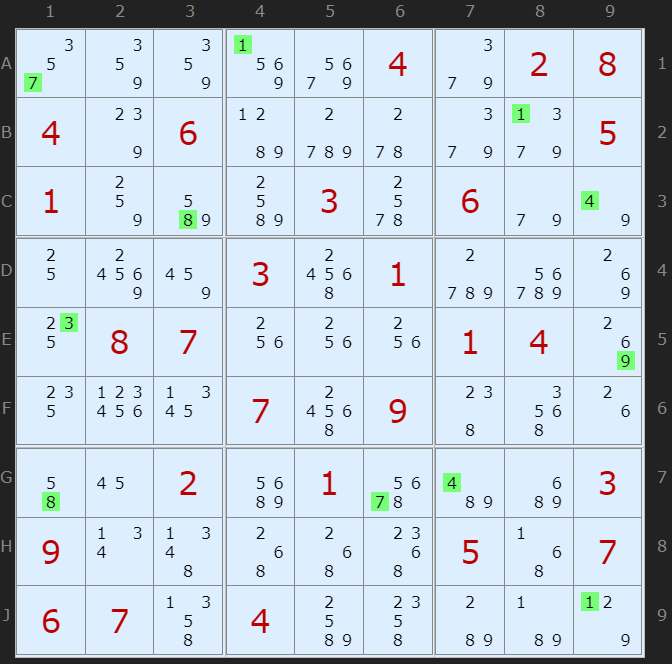

## Sudoku assignment

Build sudoku solver using C programming language.

[Reference solver](https://www.sudokuwiki.org/sudoku.htm)


### Learning objectives
- Practice programming skills
- Manage pointers, memory, references, structures

## Tasks

Students need to implements the following three algorithms. There are some functions you may need to use such as:

```
void set_candidate(Cell *cell, int value);
void unset_candidate(Cell *cell, int value);
void set_candidates(Cell *cell, int *candidates, int size);
int *get_candidates(Cell *cell);
```

### Hidden singles

- Read: [Hidden singles](https://www.sudokuwiki.org/Getting_Started) 

- Hint: You try use the [sudoku solver](https://www.sudokuwiki.org/sudoku.htm), pick the example "Gentle" and run step by step. When hidden singles are detected, the message shows the explanation for hidden singles.



```
SINGLE: A1 set to 7, unique in Column and Box
SINGLE: A4 set to 1, unique in Row
SINGLE: B8 set to 1, unique in Box
SINGLE: C3 set to 8, unique in Box
SINGLE: C9 set to 4, unique in Row and Column and Box
SINGLE: E1 set to 3, unique in Row
SINGLE: E9 set to 9, unique in Row
SINGLE: G1 set to 8, unique in Column
SINGLE: G6 set to 7, unique in Row and Box
SINGLE: G7 set to 4, unique in Column and Box
SINGLE: J9 set to 1, unique in Column
``` 


### Naked pair/triple

- Read: [Naked pair/triple](https://www.sudokuwiki.org/Naked_Candidates) 
### Hidden pair/triple

- Read: [Hidden pair/triple](https://www.sudokuwiki.org/Hidden_Candidates) 


## Overview of the sample code
Sample code present the base structure for a sudoku board, consisting 9x9 cells arranged in a two-dimensional array.

- Constraints in sudoku: the digit in each cell is unique in a row, a column and a box where it is belong to.

### Sudoku board structure:
```
struct SudokuBoard_impl
{
    int solved_counter;
    Cell **data; // 9x9 cell board

    Cell **p_rows[BOARD_SIZE];  // rows pointers
    Cell **p_cols[BOARD_SIZE];  // cols pointers
    Cell **p_boxes[BOARD_SIZE]; // boxes pointers
    Cell *solved_cells[BOARD_SIZE *
                       BOARD_SIZE]; // solved cell pointers (maximum)
};
```
- Row pointers, collumn pointers and boxes pointers: we have 9 rows, 9 collumns and 9 boxes where each consist of an array of 9 pointers refer to the cells of the board.


### Cell structure
```
struct Cell_impl
{
    int row_index;
    int col_index;
    int box_index;
    int num_candidates;
    int candidates[BOARD_SIZE];
    int value; // solved or 0
};
```
- Each cell has an array of 9 integers representing the possible values (candidates). In this array, value could be 1 or 0, indicates that a candidate is existed or not. Note that the index of array is from 0 -> 8, different from 1 -> 9 of the possible values. Then, in the set and unset functions we have: 

```
void set_candidate(Cell *cell, int value)
{
    cell->candidates[value - 1] = 1;
    cell->num_candidates += 1;
}

void unset_candidate(Cell *cell, int value)
{
    cell->candidates[value - 1] = 0;
    cell->num_candidates -= 1;
}
```

## Evaluation

Evaluation focus on correct implementation of the algorithms, therefore it would check:
- The number of found cases (number of hidden singles, number of naked pairs, naked tripples, ... ). 
- The remaining candidates after each algorithms is applied.

### Scoring rubrics

Scale of 10 points:

- Test cases with hidden singles (6 pts)
- Test cases with naked pairs/triples (2 pts)
- Test cases with hidden pairs/triples (2 pts)

## Update the latest version assignments

- The latest repository is updated on this github link 
https://github.com/ntcuong2103/sudoku-assignment

To update the `latest` code:

1. Add the remote repository
```
git remote add latest https://github.com/ntcuong2103/sudoku-assignment
```
2. Pull the code
```
git config pull.rebase true
git pull latest main
```
3. Push to remote repository
git push origin --force

## Compile, run, debug

### Compile using `make`

- Build the executable file
```
make sudoku
```
- Clean built files
```
make clean
```
- To add more source files (ex. naked_pairs.c), modify Makefile in the following line:
```
OBJS = src/hidden_singles.o src/hidden_pairs.o src/naked_pair.o
```
This will trigger the compilation of naked_pairs.c -> nake_pair.o and added this object file to build the sudoku executable file. 

### Run program

- Run with input argument: initial sudoku board (string of 81 digits)
```
./sudoku 000105000140000670080002400063070010900000003010090520007200080026000035000409000

Output:672145398145983672389762451263574819958621743714398526597236184426817935831459267
```

### Debugger

- Install c/c++ extension pack
- Add debugging configuration

Menu:
```
File > Run > Add configuration...
Add configuration... --> (gdb) Launch
```
Modify [launch.json](.vscode/launch.json)

```
            "program": "${workspaceFolder}/sudoku",
            "cwd": "${workspaceFolder}",
            "args": ["000105000140000670080002400063070010900000003010090520007200080026000035000409000"],
```

Press F5 for running debugger

### Debug test case with autograder

Modify [launch.json](.vscode/launch.json)

```
            "program": "${workspaceFolder}/autograder",
            "cwd": "${workspaceFolder}",
            "args": [
                "58h8h8j2n00hk805810hgc21o6s4c4k8ka1103h4p0p409d421k0gg14jkhg09bk03s4v0i41c8141343434030hi41c3u1q41bkg18cb824901g05r003f0ogq009g10q8qa4a4ac11a24121419a0hp49co4o2g6",
                "hidden_singles",
                "0",
            ],
```

where there are three arguments (args) must be provided: board_input, method, and pipe. Pipe could be set to 0, board_input and method can be get from [traces.json](test/traces.json)


### Run test cases

- Run all the test cases
```
make check
```
- Run range of test cases, for example 0 -> 5
```
make check-0-5
```
- Run single test case, for example 5
```
make check-5
```

### Input and expected output

The input string and expected output string represent the sudoku board with candidates. You can import it directly to the [sudoku solver](https://www.sudokuwiki.org/sudoku.htm) -> "Import a sudoku" to check the step.
